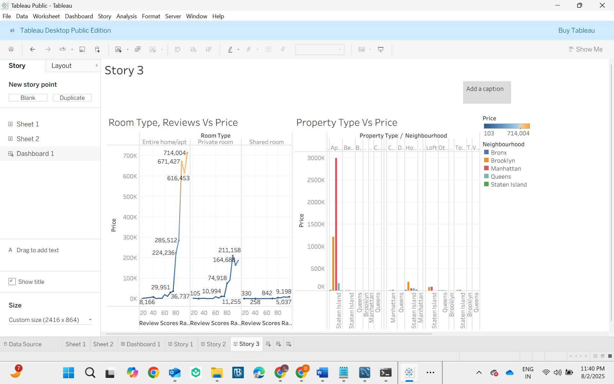

# Airbnb Price Analysis – Tableau Dashboard  

  
  
  

---

## About the Project
This project provides an **exploratory analysis** of Airbnb listings in **New York City** using Tableau Public. It visualizes **price variations** across different room types, property types, neighborhoods, and review scores to uncover key pricing patterns.

---

## Objectives
- Analyze **room type vs price** trends based on review scores.  
- Compare **property type pricing** across NYC neighborhoods.  
- Identify **outliers** and patterns useful for hosts, travelers, and analysts.

---

## Tools & Technologies
- **Tableau Public** – Dashboard creation & visualization  
- **Excel/Python (optional)** – Data cleaning & preprocessing  
- **CSV Dataset** – Airbnb NYC listings data  

---

## Dashboards & Visuals

### 1. Room Type & Reviews vs Price
- Plots **review scores against pricing** by room type (`Entire home/apt`, `Private room`, `Shared room`).

### 2. Property Type vs Price by Neighborhood
- Highlights **property types** (Apartment, Loft, Townhouse, etc.) and compares **pricing across boroughs**:
  - Bronx  
  - Brooklyn  
  - Manhattan  
  - Queens  
  - Staten Island  

---

## Preview
  

---

## Insights
- Manhattan listings command **highest average prices** across most property types.  
- **Entire homes/apartments** are priced significantly higher than private/shared rooms.  
- High review scores don’t always equate to higher prices—location and property type play a bigger role.

---

## How to Open
1. Download this repository.  
2. Open the `Tableau.twb` file using [Tableau Public](https://public.tableau.com/).  
3. Interact with the dashboard (filter by neighborhood/property type, hover for pricing details).  

---

## Repository Structure
